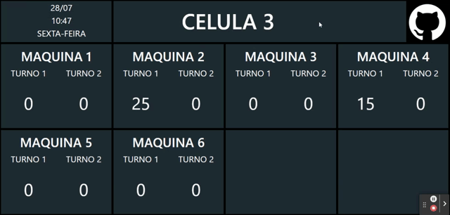

## Descrição do Projeto

Este é um painel de monitoramento de produção em tempo real que fornece visualização de dados e acompanhamento em tempo real de métricas de produção. A aplicação é construída usando Node.js, Express.js e Bootstrap para a interface do usuário responsiva. Os dados são obtidos de um banco de dados PostgreSQL e atualizados automaticamente a cada 15 minutos para fornecer informações em tempo real.

## Instalação

Siga as etapas abaixo para instalar e executar o projeto em sua máquina local:

Clone este repositório em sua máquina local:

    git clone <URL_DO_REPOSITORIO>

    cd Production-Dashboard

Instale as dependências do projeto usando o npm:

    npm install

Configure as variáveis de ambiente:

Crie um arquivo .env na raiz do projeto e defina as seguintes variáveis de ambiente:

    USER=seu_usuario_do_PostgreSQL
    
    HOST=seu_host_do_PostgreSQL
    
    DATABASE=seu_nome_do_banco_de_dados
    
    PASSWORD=sua_senha_do_PostgreSQL
    
    PORT=porta_do_PostgreSQL

Substitua os valores acima pelos valores correspondentes do seu ambiente PostgreSQL.

Substitua a query no arquivo writeQuery.js:

**Substitua a variável yourQuery com sua própria consulta SQL desejada**

    const yourQuery = `    
    SELECT * FROM sua_tabela
    WHERE sua_condicao = 'seu_valor';
    `;

Inicie o servidor:

    npm start

O servidor será iniciado e estará pronto para receber solicitações.

Acesse os painéis de monitoramento:

Abra o navegador e acesse as seguintes URLs para acompanhar a produção das células:

Para a produção da Célula 1: http://localhost:3333/celula1

Para a produção das Células 2 e 3: http://localhost:3333/celula2&3

Para a produção das Células 4 e 5: http://localhost:3333/celula4&5

Se o arquivo JSON não tiver sido gerado ou estiver vazio, os painéis retornarão valores zerados.

Dependências

 - Express.js
  - Axios
  - Dotenv
  - EJS
  - PostgreSQL (pg)
  - Nodemon **(apenas para desenvolvimento)**

Notas

Certifique-se de ter o Node.js e o PostgreSQL instalados em sua máquina antes de executar o projeto. Os painéis atualizam automaticamente a cada 15 minutos para mostrar as informações mais recentes de produção. Certifique-se de configurar corretamente as variáveis de ambiente no arquivo .env para a conexão com o banco de dados PostgreSQL. Não se esqueça de substituir a consulta no arquivo writeQuery.js com sua própria consulta desejada antes de executar o servidor. Se o arquivo JSON não for gerado ou estiver vazio, os painéis exibirão valores zerados.
